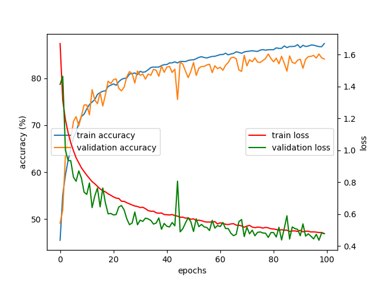
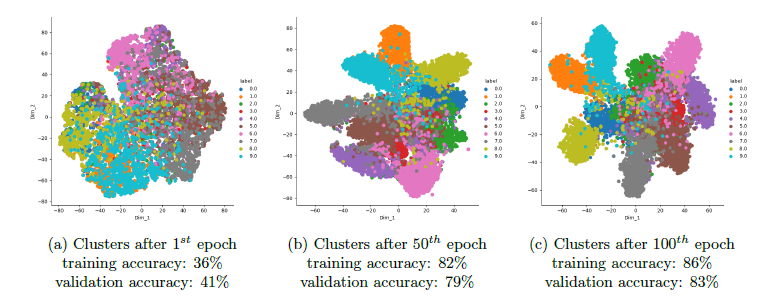

#### Implementation of a 3-layer CNN for object classification using tensorflow library

Dependencies:
* Python 3.7.10
* tensorflow:  1.15.2
* sklearn:  0.22.2
* keras:  2.3.1
* numpy:  1.19.5
* matplotlib:  3.2.2
* seaborn:  0.11.1
* pandas:  1.1.5

Please, add the data file in it and organize them in this way:
```
./
├── cifar10_data/
│   ├── batches.meta
│   ├── data_batch_1
│   ├── data_batch_2
│   ├── data_batch_3
│   ├── data_batch_4
│   ├── data_batch_5
│   ├── readme.html
│   └── test_batch
├── eval.py
├── main.py
└── model.py
```
## main.py
        
Run main.py in a Python IDE or the terminal by typing: ```python main.py```

This will train the network using a batch size of 32and a learning rate of 0.001.
It will stop when stop criteria is satisfied (around 90 epochs).
During training, at each epoch, it will evaluate the model on validation data.
It will generate train and validation loss and accuracy values for each epoch.

It will save the trained model in "trained_model".

It will show and save convergence curves.

To observe t-SNE plots presented in the repo of the project, please set ```plot_tsne = True``` in main.py file.

## model.py

Our CNN architecture is in this python file. We call this from main.py and eval.py. 

## eval.py

Run eval.py in a Python IDE or the terminal by typing: ```python eval.py```

It will take trained_model.ckpt and test data as inputs and then generate test accuracy results.

## An example of outputs

main.py:
```
MAIN.PY:
conv_1:  (?, 32, 32, 32)
batchnorm_1:  (?, 32, 32, 32)
activation_1:  (?, 32, 32, 32)
pooling_1:  (?, 16, 16, 32)
conv_2:  (?, 16, 16, 64)
batchnorm_2:  (?, 16, 16, 64)
activation_2:  (?, 16, 16, 64)
pooling_2:  (?, 8, 8, 64)
conv_3:  (?, 8, 8, 128)
batchnorm_3:  (?, 8, 8, 128)
activation_3:  (?, 8, 8, 128)
pooling_3:  (?, 4, 4, 128)
flatten:  (?, 2048)
full_connected_1:  (?, 512)
activation_4:  (?, 8, 8, 128)
dropout_4:  (?, 512)
y_pred:  (?, 10)
-> Max number of epochs =  100
-> Size of batch =  32
-> Learning_rate =  0.001
----------------------------------------------------------------------------------------------------
-> Session is started.
-> Training is started.
Epoch: 1 Training loss: 1.669 - Validation loss: 1.413 | Training accuracy: 45.509% - Validation accuracy: 49.140% 
Epoch: 2 Training loss: 1.312 - Validation loss: 1.464 | Training accuracy: 55.188% - Validation accuracy: 51.940% 
Epoch: 3 Training loss: 1.191 - Validation loss: 1.000 | Training accuracy: 59.388% - Validation accuracy: 63.600% 
Epoch: 4 Training loss: 1.111 - Validation loss: 0.936 | Training accuracy: 62.502% - Validation accuracy: 66.920% 
Epoch: 5 Training loss: 1.046 - Validation loss: 0.935 | Training accuracy: 64.990% - Validation accuracy: 66.960% 
Epoch: 6 Training loss: 0.998 - Validation loss: 0.832 | Training accuracy: 67.344% - Validation accuracy: 70.780% 
Epoch: 7 Training loss: 0.953 - Validation loss: 0.806 | Training accuracy: 68.557% - Validation accuracy: 71.820% 
Epoch: 8 Training loss: 0.921 - Validation loss: 0.871 | Training accuracy: 70.400% - Validation accuracy: 69.860% 
Epoch: 9 Training loss: 0.890 - Validation loss: 0.825 | Training accuracy: 71.855% - Validation accuracy: 71.960% 
Epoch: 10 Training loss: 0.866 - Validation loss: 0.738 | Training accuracy: 72.337% - Validation accuracy: 74.300% 
Epoch: 11 Training loss: 0.844 - Validation loss: 0.724 | Training accuracy: 73.476% - Validation accuracy: 74.300% 
Epoch: 12 Training loss: 0.824 - Validation loss: 0.795 | Training accuracy: 74.387% - Validation accuracy: 72.200% 
Epoch: 13 Training loss: 0.804 - Validation loss: 0.641 | Training accuracy: 74.916% - Validation accuracy: 77.560% 
Epoch: 14 Training loss: 0.790 - Validation loss: 0.714 | Training accuracy: 75.426% - Validation accuracy: 75.380% 
Epoch: 15 Training loss: 0.774 - Validation loss: 0.764 | Training accuracy: 76.557% - Validation accuracy: 74.560% 
Epoch: 16 Training loss: 0.758 - Validation loss: 0.646 | Training accuracy: 76.935% - Validation accuracy: 76.880% 
Epoch: 17 Training loss: 0.746 - Validation loss: 0.764 | Training accuracy: 77.223% - Validation accuracy: 74.080% 
Epoch: 18 Training loss: 0.740 - Validation loss: 0.669 | Training accuracy: 77.297% - Validation accuracy: 76.520% 
Epoch: 19 Training loss: 0.727 - Validation loss: 0.602 | Training accuracy: 78.234% - Validation accuracy: 79.360% 
Epoch: 20 Training loss: 0.718 - Validation loss: 0.604 | Training accuracy: 78.505% - Validation accuracy: 78.860% 
Epoch: 21 Training loss: 0.708 - Validation loss: 0.595 | Training accuracy: 78.782% - Validation accuracy: 79.680% 
Epoch: 22 Training loss: 0.700 - Validation loss: 0.597 | Training accuracy: 78.487% - Validation accuracy: 79.840% 
Epoch: 23 Training loss: 0.698 - Validation loss: 0.645 | Training accuracy: 79.258% - Validation accuracy: 77.820% 
Epoch: 24 Training loss: 0.681 - Validation loss: 0.654 | Training accuracy: 79.740% - Validation accuracy: 77.300% 
Epoch: 25 Training loss: 0.680 - Validation loss: 0.626 | Training accuracy: 79.948% - Validation accuracy: 78.100% 
Epoch: 26 Training loss: 0.672 - Validation loss: 0.571 | Training accuracy: 80.044% - Validation accuracy: 80.300% 
Epoch: 27 Training loss: 0.664 - Validation loss: 0.534 | Training accuracy: 80.877% - Validation accuracy: 81.400% 
Epoch: 28 Training loss: 0.657 - Validation loss: 0.544 | Training accuracy: 80.968% - Validation accuracy: 80.960% 
Epoch: 29 Training loss: 0.651 - Validation loss: 0.613 | Training accuracy: 81.108% - Validation accuracy: 78.960% 
Epoch: 30 Training loss: 0.648 - Validation loss: 0.533 | Training accuracy: 80.744% - Validation accuracy: 81.540% 
Epoch: 31 Training loss: 0.641 - Validation loss: 0.562 | Training accuracy: 81.457% - Validation accuracy: 80.600% 
Epoch: 32 Training loss: 0.643 - Validation loss: 0.555 | Training accuracy: 81.246% - Validation accuracy: 80.880% 
Epoch: 33 Training loss: 0.634 - Validation loss: 0.575 | Training accuracy: 81.374% - Validation accuracy: 79.800% 
Epoch: 34 Training loss: 0.622 - Validation loss: 0.570 | Training accuracy: 81.792% - Validation accuracy: 80.880% 
Epoch: 35 Training loss: 0.618 - Validation loss: 0.561 | Training accuracy: 82.256% - Validation accuracy: 80.600% 
Epoch: 36 Training loss: 0.619 - Validation loss: 0.538 | Training accuracy: 82.369% - Validation accuracy: 81.880% 
Epoch: 37 Training loss: 0.609 - Validation loss: 0.544 | Training accuracy: 82.349% - Validation accuracy: 81.680% 
Epoch: 38 Training loss: 0.606 - Validation loss: 0.576 | Training accuracy: 82.365% - Validation accuracy: 80.400% 
Epoch: 39 Training loss: 0.607 - Validation loss: 0.505 | Training accuracy: 82.687% - Validation accuracy: 82.600% 
Epoch: 40 Training loss: 0.598 - Validation loss: 0.542 | Training accuracy: 82.869% - Validation accuracy: 81.240% 
Epoch: 41 Training loss: 0.596 - Validation loss: 0.524 | Training accuracy: 82.898% - Validation accuracy: 82.340% 
Epoch: 42 Training loss: 0.595 - Validation loss: 0.520 | Training accuracy: 83.236% - Validation accuracy: 82.500% 
Epoch: 43 Training loss: 0.598 - Validation loss: 0.547 | Training accuracy: 83.262% - Validation accuracy: 81.220% 
Epoch: 44 Training loss: 0.591 - Validation loss: 0.527 | Training accuracy: 83.473% - Validation accuracy: 81.920% 
Epoch: 45 Training loss: 0.588 - Validation loss: 0.807 | Training accuracy: 83.238% - Validation accuracy: 75.460% 
Epoch: 46 Training loss: 0.581 - Validation loss: 0.489 | Training accuracy: 83.567% - Validation accuracy: 83.440% 
Epoch: 47 Training loss: 0.581 - Validation loss: 0.509 | Training accuracy: 83.549% - Validation accuracy: 82.960% 
Epoch: 48 Training loss: 0.575 - Validation loss: 0.546 | Training accuracy: 83.535% - Validation accuracy: 81.500% 
Epoch: 49 Training loss: 0.576 - Validation loss: 0.578 | Training accuracy: 83.771% - Validation accuracy: 80.120% 
Epoch: 50 Training loss: 0.568 - Validation loss: 0.552 | Training accuracy: 83.882% - Validation accuracy: 81.460% 
Epoch: 51 Training loss: 0.571 - Validation loss: 0.491 | Training accuracy: 83.902% - Validation accuracy: 83.340% 
Epoch: 52 Training loss: 0.561 - Validation loss: 0.571 | Training accuracy: 84.137% - Validation accuracy: 80.580% 
Epoch: 53 Training loss: 0.562 - Validation loss: 0.522 | Training accuracy: 84.428% - Validation accuracy: 82.120% 
Epoch: 54 Training loss: 0.559 - Validation loss: 0.536 | Training accuracy: 84.564% - Validation accuracy: 82.480% 
Epoch: 55 Training loss: 0.553 - Validation loss: 0.520 | Training accuracy: 84.397% - Validation accuracy: 82.500% 
Epoch: 56 Training loss: 0.550 - Validation loss: 0.516 | Training accuracy: 84.302% - Validation accuracy: 82.820% 
Epoch: 57 Training loss: 0.550 - Validation loss: 0.497 | Training accuracy: 84.479% - Validation accuracy: 82.960% 
Epoch: 58 Training loss: 0.552 - Validation loss: 0.561 | Training accuracy: 84.622% - Validation accuracy: 81.180% 
Epoch: 59 Training loss: 0.553 - Validation loss: 0.513 | Training accuracy: 84.655% - Validation accuracy: 82.640% 
Epoch: 60 Training loss: 0.538 - Validation loss: 0.528 | Training accuracy: 84.835% - Validation accuracy: 82.020% 
Epoch: 61 Training loss: 0.546 - Validation loss: 0.522 | Training accuracy: 85.010% - Validation accuracy: 82.320% 
Epoch: 62 Training loss: 0.542 - Validation loss: 0.548 | Training accuracy: 85.035% - Validation accuracy: 81.680% 
Epoch: 63 Training loss: 0.537 - Validation loss: 0.510 | Training accuracy: 85.308% - Validation accuracy: 82.740% 
Epoch: 64 Training loss: 0.535 - Validation loss: 0.510 | Training accuracy: 84.970% - Validation accuracy: 83.320% 
Epoch: 65 Training loss: 0.539 - Validation loss: 0.480 | Training accuracy: 85.146% - Validation accuracy: 84.320% 
Epoch: 66 Training loss: 0.540 - Validation loss: 0.465 | Training accuracy: 85.261% - Validation accuracy: 84.460% 
Epoch: 67 Training loss: 0.531 - Validation loss: 0.474 | Training accuracy: 85.610% - Validation accuracy: 84.120% 
Epoch: 68 Training loss: 0.530 - Validation loss: 0.553 | Training accuracy: 85.483% - Validation accuracy: 81.740% 
Epoch: 69 Training loss: 0.527 - Validation loss: 0.566 | Training accuracy: 85.292% - Validation accuracy: 81.440% 
Epoch: 70 Training loss: 0.518 - Validation loss: 0.460 | Training accuracy: 85.572% - Validation accuracy: 84.860% 
Epoch: 71 Training loss: 0.525 - Validation loss: 0.518 | Training accuracy: 85.690% - Validation accuracy: 82.620% 
Epoch: 72 Training loss: 0.530 - Validation loss: 0.477 | Training accuracy: 85.745% - Validation accuracy: 83.920% 
Epoch: 73 Training loss: 0.519 - Validation loss: 0.500 | Training accuracy: 85.852% - Validation accuracy: 83.500% 
Epoch: 74 Training loss: 0.515 - Validation loss: 0.464 | Training accuracy: 85.745% - Validation accuracy: 84.300% 
Epoch: 75 Training loss: 0.519 - Validation loss: 0.486 | Training accuracy: 85.692% - Validation accuracy: 83.420% 
Epoch: 76 Training loss: 0.517 - Validation loss: 0.489 | Training accuracy: 85.972% - Validation accuracy: 83.340% 
Epoch: 77 Training loss: 0.512 - Validation loss: 0.482 | Training accuracy: 86.072% - Validation accuracy: 83.760% 
Epoch: 78 Training loss: 0.517 - Validation loss: 0.481 | Training accuracy: 85.956% - Validation accuracy: 84.180% 
Epoch: 79 Training loss: 0.514 - Validation loss: 0.454 | Training accuracy: 86.045% - Validation accuracy: 85.140% 
Epoch: 80 Training loss: 0.509 - Validation loss: 0.485 | Training accuracy: 86.054% - Validation accuracy: 84.200% 
Epoch: 81 Training loss: 0.507 - Validation loss: 0.485 | Training accuracy: 86.067% - Validation accuracy: 83.480% 
Epoch: 82 Training loss: 0.504 - Validation loss: 0.457 | Training accuracy: 86.449% - Validation accuracy: 84.260% 
Epoch: 83 Training loss: 0.499 - Validation loss: 0.518 | Training accuracy: 86.332% - Validation accuracy: 83.060% 
Epoch: 84 Training loss: 0.503 - Validation loss: 0.438 | Training accuracy: 86.338% - Validation accuracy: 84.660% 
Epoch: 85 Training loss: 0.499 - Validation loss: 0.510 | Training accuracy: 86.856% - Validation accuracy: 83.180% 
Epoch: 86 Training loss: 0.500 - Validation loss: 0.590 | Training accuracy: 86.507% - Validation accuracy: 81.480% 
Epoch: 87 Training loss: 0.492 - Validation loss: 0.444 | Training accuracy: 86.732% - Validation accuracy: 84.740% 
Epoch: 88 Training loss: 0.495 - Validation loss: 0.520 | Training accuracy: 86.738% - Validation accuracy: 83.360% 
Epoch: 89 Training loss: 0.495 - Validation loss: 0.509 | Training accuracy: 86.787% - Validation accuracy: 83.120% 
Epoch: 90 Training loss: 0.492 - Validation loss: 0.505 | Training accuracy: 87.134% - Validation accuracy: 83.820% 
Epoch: 91 Training loss: 0.499 - Validation loss: 0.465 | Training accuracy: 86.494% - Validation accuracy: 84.040% 
Epoch: 92 Training loss: 0.489 - Validation loss: 0.539 | Training accuracy: 86.998% - Validation accuracy: 82.100% 
Epoch: 93 Training loss: 0.494 - Validation loss: 0.462 | Training accuracy: 86.745% - Validation accuracy: 84.000% 
Epoch: 94 Training loss: 0.493 - Validation loss: 0.477 | Training accuracy: 86.829% - Validation accuracy: 84.580% 
Epoch: 95 Training loss: 0.488 - Validation loss: 0.462 | Training accuracy: 87.049% - Validation accuracy: 84.640% 
Epoch: 96 Training loss: 0.489 - Validation loss: 0.445 | Training accuracy: 87.025% - Validation accuracy: 84.840% 
Epoch: 97 Training loss: 0.487 - Validation loss: 0.473 | Training accuracy: 86.860% - Validation accuracy: 84.280% 
Epoch: 98 Training loss: 0.485 - Validation loss: 0.436 | Training accuracy: 86.718% - Validation accuracy: 85.140% 
Epoch: 99 Training loss: 0.485 - Validation loss: 0.482 | Training accuracy: 86.687% - Validation accuracy: 84.320% 
Epoch: 100 Training loss: 0.479 - Validation loss: 0.478 | Training accuracy: 87.365% - Validation accuracy: 84.080% 
-> Model trained_model is saved.
-> Session is ended.
<Figure size 640x480 with 2 Axes>
```

Impact of using dropout and BN with momentum value = 0.9 (test accuracy: 83.24%)
<p align="center"></p>

eval.py:
```
-> Data is loaded and normalized.
conv_1:  (None, 32, 32, 32)
batchnorm_1:  (None, 32, 32, 32)
activation_1:  (None, 32, 32, 32)
pooling_1:  (None, 16, 16, 32)
conv_2:  (None, 16, 16, 64)
batchnorm_2:  (None, 16, 16, 64)
activation_2:  (None, 16, 16, 64)
pooling_2:  (None, 8, 8, 64)
conv_3:  (None, 8, 8, 128)
batchnorm_3:  (None, 8, 8, 128)
activation_3:  (None, 8, 8, 128)
pooling_3:  (None, 4, 4, 128)
flatten:  (None, 2048)
full_connected_1:  (None, 512)
activation_4:  (None, 8, 8, 128)
dropout_4:  (None, 512)
y_pred:  (None, 10)
-> Checkpoints are restored from trained_model
-> Test set accuracy 83.24%
```
t-SNE representation by using output of first fully connected layer (dimension of 512):
<p align="center"></p>

## References

"Cifar-10 benchmark (image classification) | papers with code." https://paperswithcode:com/sota/image-classification-on-cifar-10. (Accessed on 05/22/2021).

"Cifar-10 and cifar-100 datasets." https://www:cs:toronto:edu/~kriz/cifar:html. (Accessed on 05/22/2021).

"Cifar-10 image classification in tensorfow | by park chansung | towards data science." https://towardsdatascience:com/cifar-10-image-classification-in-tensorflow-5b501f7dc77c. (Accessed on 05/22/2021).

"How to develop a cnn from scratch for cifar-10 photo classification." https://machinelearningmastery:com/how-to-develop-a-cnn-from-scratch-for-cifar-10-photo-classification/. (Accessed on 05/22/2021).

"Normalizing inputs (c2w1l09) - youtube." https://www:youtube:com/watch?v=FDCfw-YqWTE&abnchannel=DeepLearningAI. (Accessed on 05/22/2021).

"C4w2l10 data augmentation - youtube." https://www:youtube:com/watch?v=JI8saFjK84o&abnchannel=DeepLearningAI. (Accessed on 05/22/2021).

"tf.keras.preprocessing.image.imagedatagenerator." https://www:tensorflow:org/apindocs/python/tf/keras/preprocessing/image/ImageDataGenerator. (Accessed on 05/22/2021).

"Deep-learning-with-keras/keras cifar10 v1.py at master · packtpublishing/deep-learning-withkeras."
https://github:com/PacktPublishing/Deep-Learning-with-Keras/blob/master/Chapter03/kerasnCIFAR10nV1:py. (Accessed on 05/22/2021).

"Convolutional neural network 4: data augmentation ai geek programmer." https://aigeekprogrammer:com/convolutional-neural-network-4-data-augmentation/. (Accessed on 05/22/2021).

"moritzhambach/image-augmentation-in-keras-cifar-10-: Using image augmentation to reach 90.3% accuracy on cifar-10 in 100 epochs with a simple cnn.." https://github:com/moritzhambach/Image-Augmentation-in-Keras-CIFAR-10-. (Accessed on 05/22/2021).

"Data augmentation with keras using cifar-10 | kaggle." https://www:kaggle:com/mielek/data-augmentation-with-keras-using-cifar-10. (Accessed on 05/22/2021).

"Image classification with tensorflow 2.0 ( without keras ) | by shubham panchal | becoming human: Artificial intelligence magazine." https://becominghuman:ai/image-classification-with-tensorflow-2-0-without-keras-e6534adddab2. (Accessed on 05/27/2021).

"exelban/tensorflow-cifar-10: Cifar-10 cnn implementation using tensorflow library with 20%error.." https://github:com/exelban/tensorflow-cifar-10. (Accessed on 05/27/2021).

"How to develop a cnn from scratch for cifar-10 photo classification." https://machinelearningmastery:com/how-to-develop-a-cnn-from-scratch-for-cifar-10-photo-classification/. (Accessed on 05/27/2021).

"zekikus/tensorflow-cnn-with-cifar10-dataset: Tensorflow kütüphanesi kullanarak konvolusyonel sinir ag(convolutional neural network) yapısının kodlanmasını ve bu yapının cifar10 veri seti ile eğitilmesi.." https://github:com/zekikus/Tensorflow-CNN-with-CIFAR10-Dataset. (Accessed on 05/27/2021).

"Lmaxence/cifar10-classification: Creation of a simple 8-layered cnn with 78% accuracy on cifar10." https://github:com/LMaxence/cifar10-classification. (Accessed on
05/22/2021).

D. P. Kingma and J. Ba, "Adam: A method for stochastic optimization," arXiv preprint arXiv:1412.6980, 2014.

S. Ruder, "An overview of gradient descent optimization algorithms," arXiv preprint arXiv:1609.04747, 2016.

"Optimisation algorithm | adaptive moment estimation(adam) | by jeremy zhang | towards data science." https://towardsdatascience:com/optimisation-algorithm-adaptive-moment-estimation-adam-92144d75e232. (Accessed on 05/22/2021).

"tf.compat.v1.train.adamoptimizer | tensorflow core v2.5.0." https://www:tensorflow:org/apidocs/python/tf/compat/v1/train/AdamOptimizer. (Accessed on 05/22/2021).

Y. Bengio, "Practical recommendations for gradient-based training of deep architectures," in Neural networks: Tricks of the trade, pp. 437-478, Springer, 2012.

S. Ioffe and C. Szegedy, "Batch normalization: Accelerating deep network training by reducing internal covariate shift," CoRR, vol. abs/1502.03167, 2015.

K. He, X. Zhang, S. Ren, and J. Sun, "Deep residual learning for image recognition," in Proceedings of the IEEE conference on computer vision and pattern recognition, pp. 770-778, 2016.

X. Li, S. Chen, X. Hu, and J. Yang, "Understanding the disharmony between dropout and batch normalization by variance shift," in Proceedings of the IEEE/CVF Conference on Computer Vision and Pattern Recognition, pp. 2682-2690, 2019.

"A disciplined approach to neural network hyper-parameters: Learning rate, batch size, momentum, and weight decay - paper dissected - let the machines learn."https://yashuseth:blog/2018/11/26/hyper-parameter-tuning-best-practices-learning-rate-batch-size-momentum-weight-decay/". (Accessed on 05/26/2021).

"Batchnorm: Fine-tune your booster | by ilango rajagopal | medium." https://medium:com/@ilango100/batchnorm-fine-tune-your-booster-bef9f9493e22. (Accessed on 05/26/2021).

"Representation learning | cifar-10 | by philip slingerland | medium." https://medium:com/@pslinge144/representation-learning-cifar-10-23b0d9833c40. (Accessed on 05/26/2021).

"2019 iccd characterizing gpgpu trafic with deep learning.pdf." http://web:engr:oregonstate:edu/~chenliz/publications/2019ICCDCharacterizing%20GPGPU%20Traffic%20with%20Deep%20Learning:pdf. (Accessed on 05/26/2021).

W. Zhang, G. Peng, C. Li, Y. Chen, and Z. Zhang, "A new deep learning model for fault diagnosis with good anti-noise and domain adaptation ability on raw vibration signals," Sensors, vol. 17, no. 2, p. 425, 2017.

##### This project was implemented for CmpE 597 Deep Learning Course of Bogazici University.
